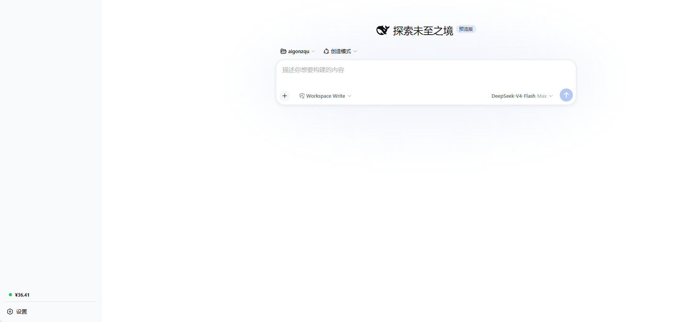
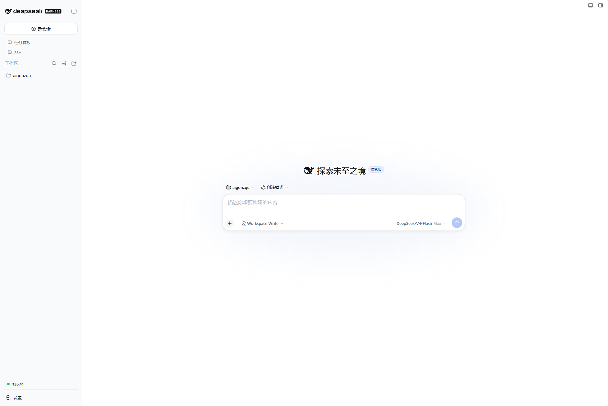

# dsh-billing — DSH Web GUI 实时计费监控插件

> [English](README.en.md) · 中文

为 [DeepSeek Harness](https://github.com/deepseek-ai/dsh)（DSH）Web GUI 定制的计费
监控插件：实时统计本机模型调用用量与费用，按供应商/模型单价计费（DeepSeek v4
峰谷价），支持余额锚定、官方单价同步与账本持久化。全部通过官方接口与客户端
slots 系统实现，不修改 DSH 源码。

## 能力

| 能力 | 说明 |
| --- | --- |
| 实时余额 | 侧边栏底部余额 pill，2 秒刷新；余额状态点（充足 / 不足 / 耗尽，告警闪烁） |
| 概览面板 | 点击 pill 在侧边栏内展开：已消费 / 调用次数 / 输入 / 输出 token + 最近流水（峰谷标签），收起侧边栏自动收起 |
| 供应商计费 | 按 供应商+模型 → 同名模型 → 供应商默认 → 全局默认 匹配单价；DeepSeek v4 自 08-17 起峰谷定价（高峰 = 北京 9–12、14–18，空闲半价），命中缓存输入按低单价计 |
| 官方余额同步 | 填入 DeepSeek API Key，一键调用官方 `GET /user/balance` 拉取余额（总余额 / 赠金 / 充值）并自动锚定；也支持手动粘贴校准 |
| 官方同步 | 一键拉取 DeepSeek 官方模型单价（内置基础价 + 持久化覆盖合并） |
| 设置页 | DSH 设置 → 「计费」分段：余额、阈值、默认单价、供应商单价表格、数据管理 |
| Agent 工具 | `billing_balance`：查询余额、费用、token 用量与按模型明细 |
| 持久化 | 账本 JSON 原子写入工作区，DSH 重启后自动恢复（余额、单价、流水） |

## 截图





## 安装

本包为**纯 JS、无构建步骤**（`lib/` 即发布产物），git 安装即可用，无需
`prepare` 脚本、无需构建授权（符合官方打包规范）：

```sh
# 从本仓库安装
dsh plugin --profile web add github:nianpangzhi233/dsh-billing

# 或本地 checkout / tarball
dsh plugin --profile web add ./dsh-billing
dsh plugin --profile web add ./dsh-billing-0.1.0.tgz
```

安装后**重启 `dsh web`**：侧边栏底部出现余额 pill（设置按钮上方）、
DSH 设置中出现「计费」分段，Agent 提示词中自动出现 `billing_balance` 工具说明。

## 配置

DSH 设置 → 「计费」分段（或侧边栏底部 pill 展开面板）：

- **余额**：DeepSeek API Key（sk-…）自动同步官方余额（总余额 / 赠金 / 充值，
  限流约 1 次/分钟）、手动粘贴锚定、初始余额、低余额告警阈值（默认 ¥20）
- **计费单价**：未知供应商默认单价（¥ / 1M tokens）+ 按供应商/模型单价表，
  可增删行；「同步官方单价」一键拉取 DeepSeek 官方价目
- **数据**：账本路径与保存时间、保存配置、重置用量（两次点击确认）

## 数据

- 账本文件：`.dsh-billing-ledger.json`（工作区目录优先，spRoot 兜底），
  v2 结构：`config`（初始余额 / 阈值 / API Key / 单价嵌套表）/ `usage`（token 分项计数）/
  `ledger`（每次调用流水，含峰谷费率）/ `startedAt`
- 单价匹配顺序：供应商+模型 → 任意供应商同名模型 → 该供应商默认 → 全局默认
- 峰谷价：高峰 = 北京 9–12、14–18；其余为谷（半价）；08-17 起对 deepseek 供应商 v4 模型生效

## 注意事项

- **只统计本机 DSH 的模型调用**；官方余额含其他渠道消费，建议定期同步校准。
- **API Key 以明文存于本机账本文件**（与 `~/.dsh/dsh-ssh.json` 同一信任模型，
  文件权限 0600）；同步请求仅发给 `api.deepseek.com`，响应只取余额字段。
- token 用量按分离计数：未命中输入（`inputTokens`）、缓存命中输入
  （`cacheReadTokens`）、输出（`outputTokens`）。
- 计费为估算，单价与费率以 DeepSeek 官方为准；「同步官方单价」仅在官方
  价目页可达时生效（需要平台 web provider）。
- 路由 `/api/dsh-billing/*` 仅限 loopback（同源校验）。

## 许可

[MIT](LICENSE)
